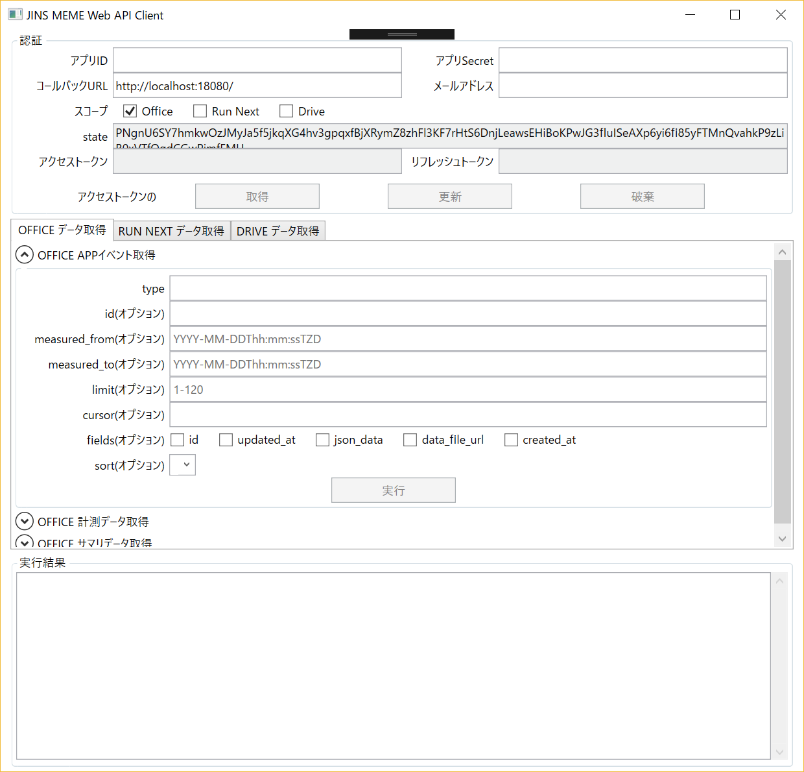
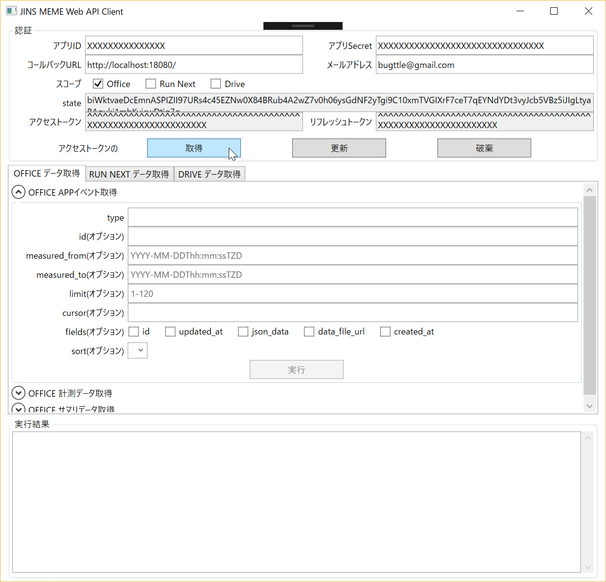
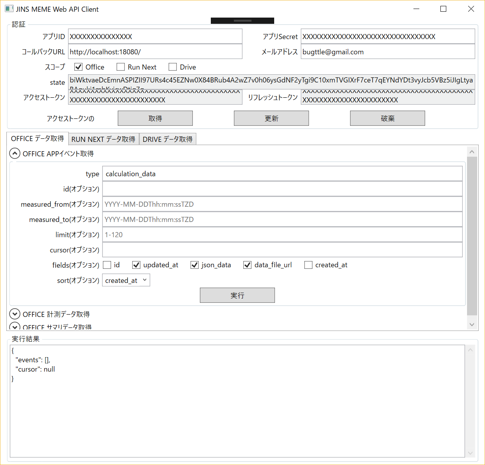

# JinsMeme-WebAPI-Client
JINS MEME Web API client for Windows.

## About
「JINS MEME Web APIの利用に関して」を良くお読みください。

https://jins-meme.github.io/sdkdoc/api/about_api.html

## Register
JINS MEMEのアカウントを作成し、アプリケーションの登録を行います。

https://jins-meme.github.io/sdkdoc/api/register.html

以下の設定をします。
* プラットフォーム
    * Web
* OAuthリダイレクトURL
    * http://localhost:18080/ (最後の"/"も必要です)
* アクセス
    * JINS MEME OFFICE データの参照
    * JINS MEME RUN NEXT データの参照
    * JINS MEME DRIVE データの参照

## Launch

### アプリケーション起動時
* 起動すると、「http://localhost:18080」で待ち受けます。

### アクセストークン取得
* 以下の項目を入力
    * アプリID
    * アプリSecret
    * コールバックURL
    * メールアドレス
    * スコープ(Office, Run Next, Drive)
* 「アクセストークンの取得」をクリックするとブラウザが起動し、OAuthが始まります。

### API実行
* 取得したアクセストークンでAPIの呼び出しができます。

